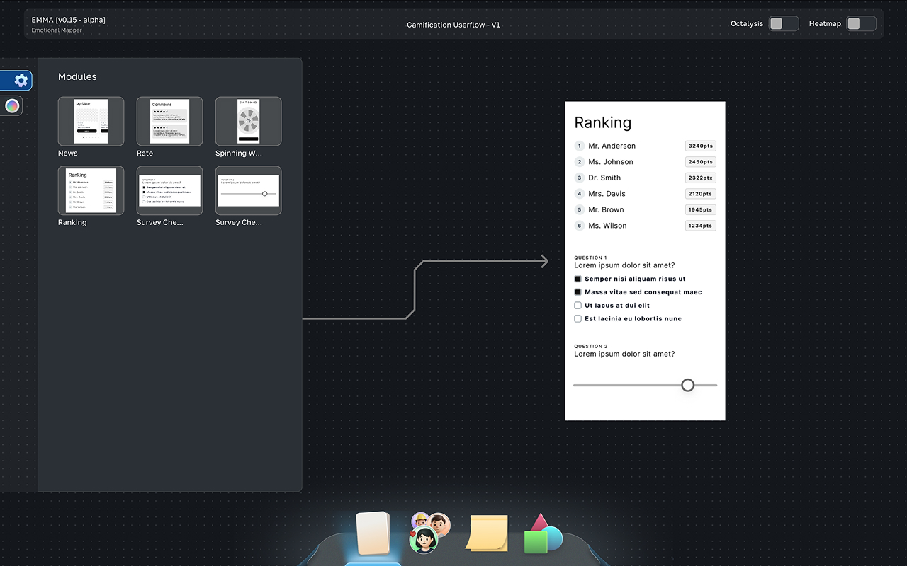
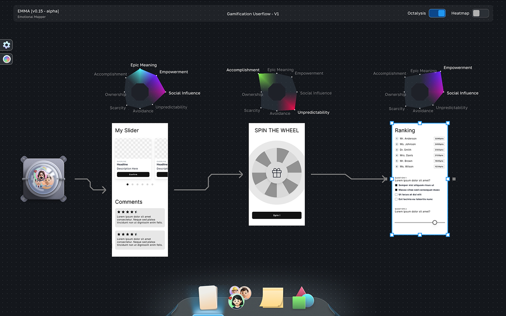
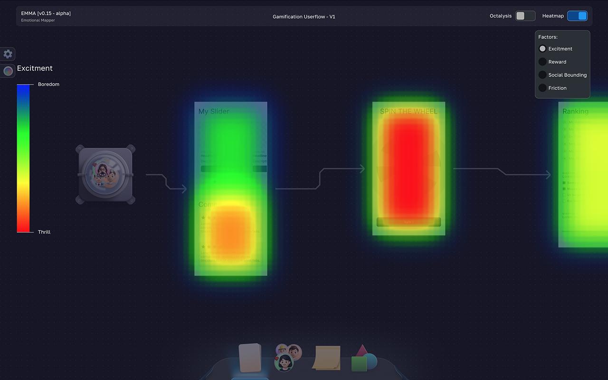
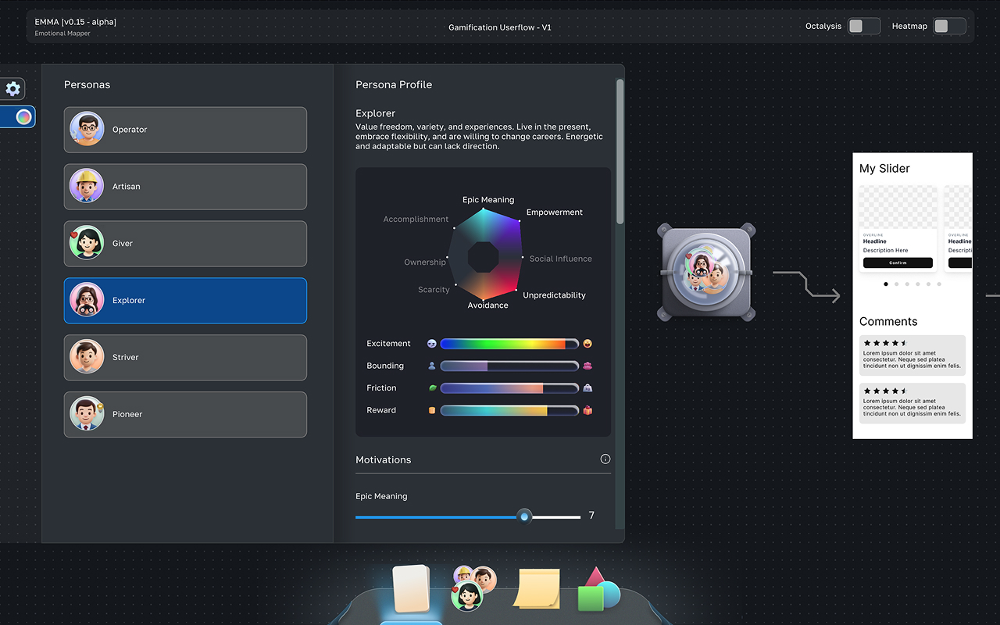

# Emotional Mapper

**Emotional Mapper** is a userflow analysis tool built as part of a broader R&D initiative focused on crafting more engaging user experiences. It lets you design a user flow, then analyze and balance it across engagement, predicted reward, social interaction, and friction, all before it ever reaches production.

The tool also supports custom user personas, which can be linked to a flow to simulate how different types of users might respond to it, and includes an Octalysis-based breakdown of what's actually driving engagement at each step.

> ⚠️ **Experimental project.** This is a research prototype built to explore flow/engagement analysis concepts. It has not been hardened or validated for production use expect rough edges, and treat outputs as directional rather than definitive.

## Why

Designing an engaging flow is easy to get wrong in ways that are hard to see just by reading a spec or looking at a wireframe: too much friction here, not enough reward there, an interaction that reads as social but isn't. Emotional Mapper was built to make those imbalances visible to turn "does this flow feel right?" into something you can actually inspect, measure, and iterate on.

## Part of a Larger Project

Emotional Mapper is one component of a broader solution aimed at improving overall user engagement design. It's built to work standalone but is intended to eventually integrate with the rest of that ecosystem.

## Key Features

### 1. Flow Building
Add or remove modules, create frames, and link them together to construct a full user flow.

---

### 2. Octalysis / Engagement Drive Analysis
Analyze each frame through an Octalysis lens to understand which engagement drivers are actually at play.

---

### 3. Flow Heatmap
Visualize the entire flow as a heatmap, switching between different attribute scales such as excitement, friction, social interaction, and reward.

---

### 4. Persona Simulation
Create a customizable user persona and connect it to a flow to predict how that persona is likely to behave and feel at each step.

> Persona creation currently supports customizing a base persona; support for adding entirely new personas from scratch is planned.

## Tech Stack

- **Language:** C / C++
- **UI:** [Dear ImGui](https://github.com/ocornut/imgui)
- **Compute:** A custom WebGPU engine (developed in-house), used as a library for heavier computation such as heatmap blurring

## Status & Roadmap

This project is a work-in-progress research tool. Planned/possible directions include:

- [ ] Support for creating new personas from scratch (not just customizing existing ones)
- [ ] Further validation of engagement/heatmap models against real usage data
- [ ] Performance and stability testing for larger flows
- [ ] Broader integration with the parent solution project
